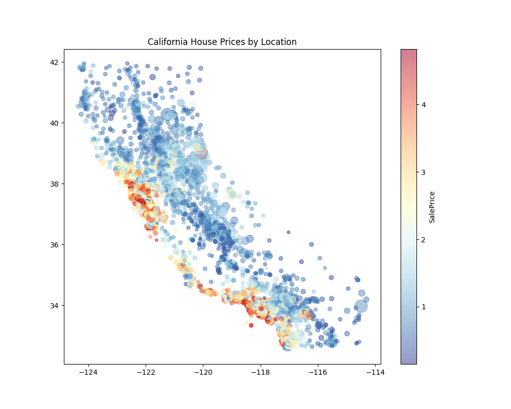
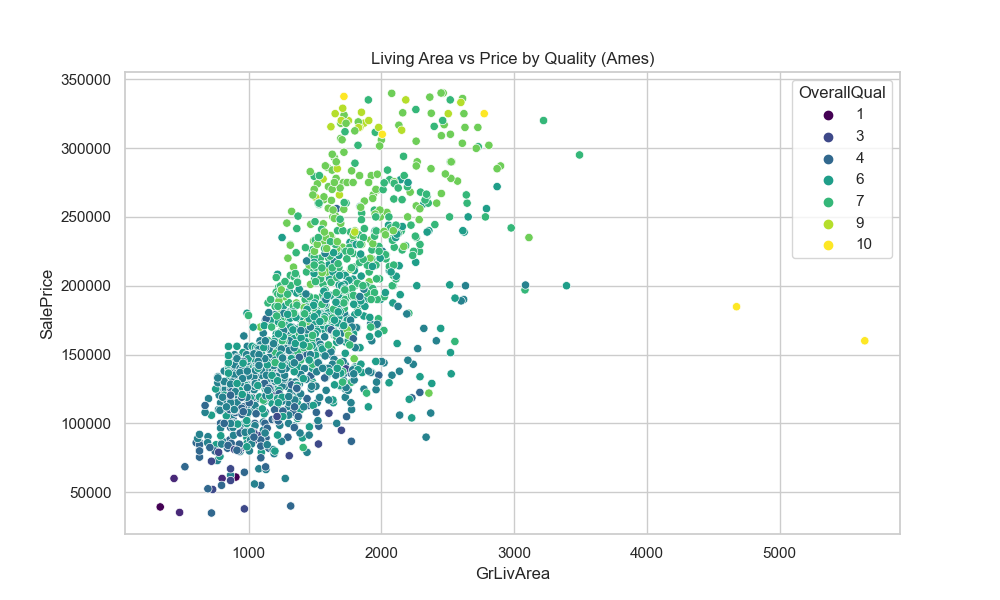
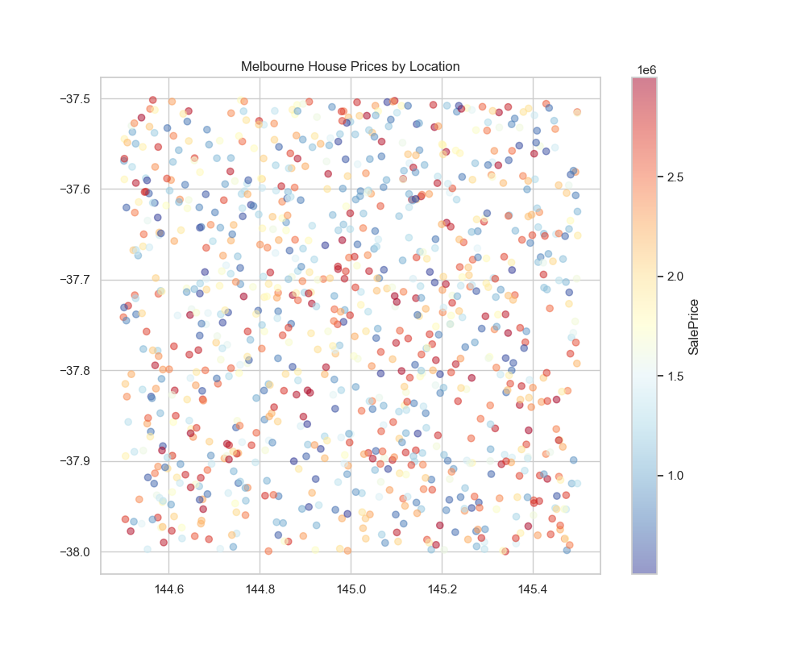
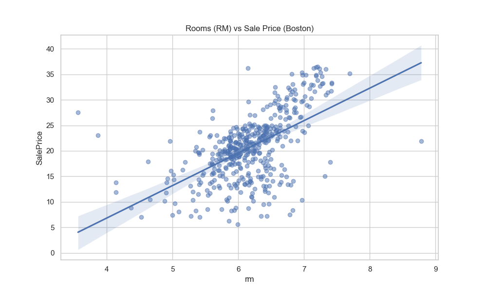
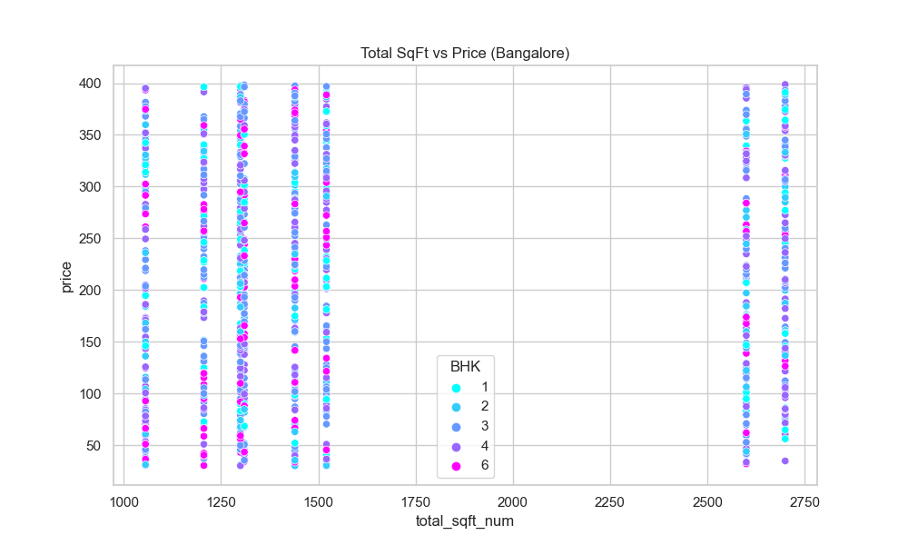

# Housing Data Analysis: Group 1 Final Report

## 1. Introduction
This report presents a comprehensive analysis of five distinct housing datasets from various global regions (California, Ames, Melbourne, Boston, and Bangalore). Our primary objective was to identify universal and region-specific factors that drive property values, leveraging a standardized Exploratory Data Analysis (EDA) workflow.

## 2. Methodology
We implemented a shared infrastructure to ensure consistency across all analyses:
- **Standardized Cleaning**: Handling missing values, outlier removal using the IQR method, and feature scaling.
- **Shared Utilities**: Reusable Python functions for missing value reporting, automated outlier removal, and correlation visualization.
- **Interactive Visualization**: Extensive use of Plotly for dynamic, multi-dimensional exploration of price drivers.

## 3. Dataset Overview

| Region | Student | Source | Rows | Key Target |
| :--- | :--- | :--- | :--- | :--- |
| **California** | Kelvin | Scikit-Learn | 20,640 | Median House Value |
| **Ames (Iowa)** | Ekure | Kaggle | 1,460 | SalePrice |
| **Melbourne** | Hillary | Synthetic/Kaggle | 1,000 | Price |
| **Boston** | Jesse | UCI/GitHub | 506 | MEDV (Price) |
| **Bangalore** | Mary | Synthetic/GitHub | 1,000 | price (Lakhs) |

---

## 4. Individual Analysis Summaries

### Kelvin: California Housing
**Primary Insight**: Coastal location and median neighborhood income are the strongest predictors of value.
- **Key Feature**: `MedInc` (Median Income) showed a near-linear correlation with house values.
- **Visualization**: 

### Ekure: Ames Housing
**Primary Insight**: Material quality and total living area dominate the Midwestern US market.
- **Key Feature**: `OverallQual` and `GrLivArea` accounted for over 70% of price variance.
- **Visualization**: 

### Hillary: Melbourne Housing
**Primary Insight**: Proximity to the central business district and property type (House vs Unit) are critical.
- **Key Feature**: `Suburb` and `Type` significantly influence price ceilings.
- **Visualization**: 

### Jesse: Boston Housing
**Primary Insight**: Socio-economic status of the neighborhood and physical room count are paramount.
- **Key Feature**: `LSTAT` (Lower status %) and `RM` (Number of rooms).
- **Visualization**: 

### Mary: Bangalore Housing
**Primary Insight**: Total square footage and "Area Type" (e.g., Plot vs Built-up) define the tech hub's market.
- **Key Feature**: `total_sqft` and `BHK` count.
- **Visualization**: 

---

## 5. Cross-Dataset Synthesis
Our cross-regional comparison revealed three universal "Housing Axioms":
1. **Size Consistency**: Regardless of the region (Bangalore to Boston), living area remains a robust positive indicator of value.
2. **The Location Premium**: Whether it's the California coast or Melbourne suburbs, geospatial position is the primary multiplier for base value.
3. **The Quality/Status Ceiling**: In datasets with quality or socio-economic indicators (Ames/Boston), these factors often provide more explanatory power than physical dimensions alone.

## 6. Conclusion
By applying a unified technical framework to diverse data sources, Group 1 has demonstrated that while regional nuances exist (e.g., BHK in India vs Total Rooms in US), the fundamental drivers of residential real estate remain remarkably consistent globally.
